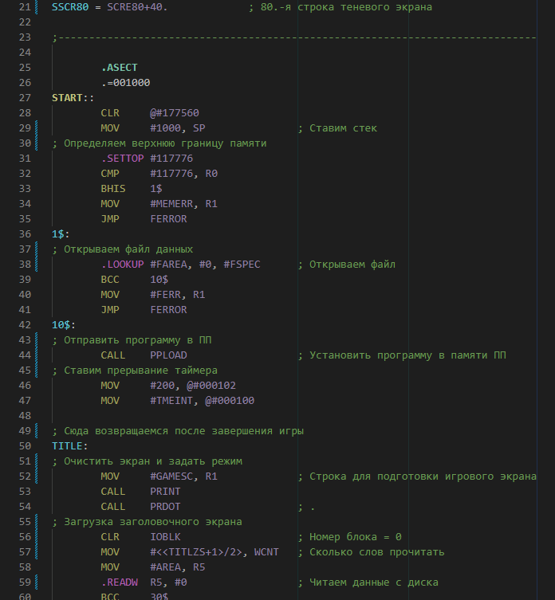

# macro11-syntax-vscode

https://marketplace.visualstudio.com/items?itemName=nzeemin.macro11-syntax-vscode

This VS Code extension provides basic syntax highlighting for MACRO11 files (.MAC and .INC).

